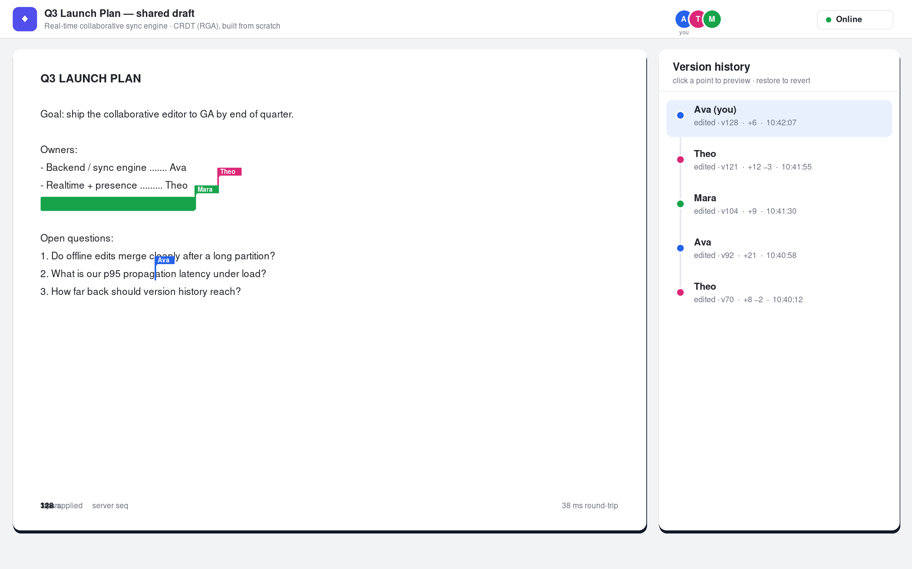
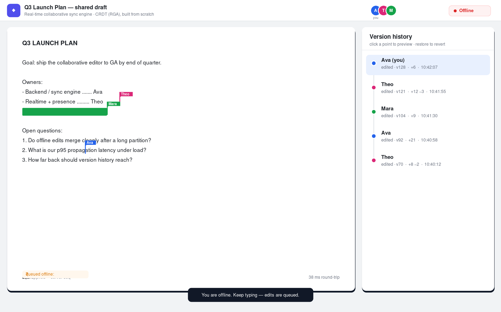
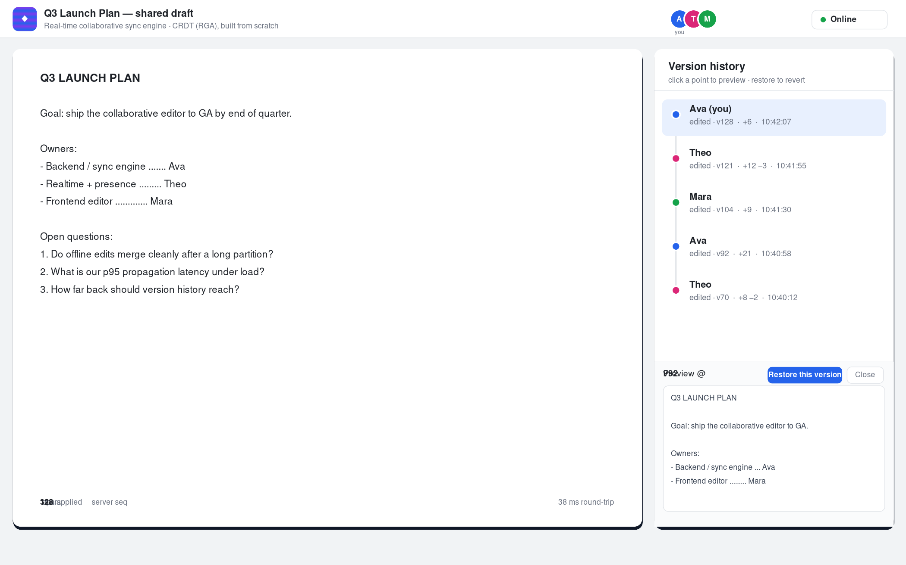

<div align="center">

# Syncpad — Real-Time Collaborative Sync Engine

**The backend behind Google-Docs-style live editing — built from first principles.**

Multiple people edit the same document at once and converge to identical text. No locks,
no last-writer-wins clobbering. The conflict-resolution core is a **CRDT (tree-based RGA)
written from scratch** — no CRDT library, and even the WebSocket layer is hand-rolled on the
Go standard library.

`Go` · `WebSockets` · `CRDT (RGA)` · `Distributed Systems` · `Vanilla JS`

</div>

---



> Several people editing one document in real time — each with a live, coloured cursor and
> name flag. Everyone converges to identical text regardless of who typed what, when.

---

## Why this project

Most developers *consume* sync engines — Firebase, Liveblocks, Yjs — without ever
understanding how concurrent edits merge without conflicts. Implementing that
conflict-resolution logic yourself is one of the most respected, least-attempted backend
skills there is. This project does exactly that: the merge algorithm is built from the
ground up and **its convergence is proven with an automated test**, not just asserted.

## What it does

| | Feature | How it works |
|---|---|---|
| ✅ | **Concurrent editing that converges** | A tree-based RGA CRDT: every character has a stable global id, so edits commute and any order yields identical text. |
| ✅ | **Conflict resolution from scratch** | No CRDT library. Core engine is ~250 lines in `internal/crdt/rga.go`. |
| ✅ | **Offline edits that merge** | Edits made while offline are queued locally and merged on reconnect via delta-sync — nothing is overwritten. |
| ✅ | **Full history + time-travel revert** | The append-only op log *is* the history. Preview any version; restore by prefix replay. |
| ✅ | **Sub-second propagation** | In-memory fan-out over WebSockets; the UI shows live round-trip latency. |
| ✅ | **Disconnect / reconnect mid-edit** | Auto-reconnect replays a `hello{since}` handshake; idempotent ops mean no loss, no duplication. |
| ✅ | **Live presence** | Remote cursors, selections, and an avatar row — on a separate ephemeral channel. |

## Screenshots

**Offline mode** — keep typing with no connection; edits queue and merge on reconnect.



**Version history** — scrub the timeline, preview any past version, and restore it.



## How it works (the 30-second version)

The document is a **tree of character nodes**. Each node carries a globally unique id
(`{site, seq}`), the id of the character it was inserted *after*, the character itself, and
a tombstone flag. The visible text is a **deterministic pre-order traversal** of that tree
(children visited in descending id order).

Because the tree's shape is fully determined by the *set* of operations — not their arrival
order — and reading is a pure function of the tree, **any two replicas with the same ops
produce byte-identical text.** That's the whole convergence guarantee. Out-of-order ops are
buffered until their parent exists (so offline batches merge), and applying an op twice is a
no-op (so reconnect re-delivery is safe).

Full architecture and the formal convergence argument: **[DESIGN.md](DESIGN.md)**.

## Run it

Requires Go 1.21+.

```bash
cd collab-sync
go run ./cmd/server          # http://localhost:8080
```

Open **two browser windows** at <http://localhost:8080> and type in both. You'll see live
cursors, presence avatars, and instant convergence. (Use an incognito window for a clearly
separate identity.)

## Prove it converges

```bash
go test ./...                    # convergence / idempotency / offline-merge / revert
node tools/convergence.test.js   # the same suite, no Go required
```

The convergence test generates a rich op log from several simulated clients, then applies
the **same op set in 12 shuffled orders across 25 seeds** and asserts every result is
byte-identical — plus idempotency, offline-partition merge, and history-replay checks.

## Project layout

```
cmd/server/         entrypoint — HTTP, static files, /ws endpoint
internal/crdt/      the RGA CRDT engine + convergence tests   ← the core
internal/server/    hand-rolled WebSocket, message protocol, broadcast hub + history
web/                browser client (same RGA engine in JS) + UI
tools/              runnable JS convergence harness
DESIGN.md           architecture + convergence proof
```

## Tech stack

- **Backend / engine:** Go (goroutine-per-connection, mutex-guarded authoritative doc, channel fan-out)
- **Conflict resolution:** CRDT — tree-based RGA, implemented from scratch
- **Transport:** WebSockets — custom RFC 6455 implementation on Go's stdlib (zero networking deps)
- **Frontend:** vanilla JavaScript, HTML, CSS (no framework)
- **Testing:** Go `testing` + a Node property/convergence harness
- **Concepts:** eventual consistency, optimistic concurrency, offline-first sync, presence

## Limitations & next steps (honest)

- **Plain text today.** The engine is a sequence CRDT; structured docs (a spreadsheet grid)
  are a natural extension — a map-of-cells CRDT whose values are RGA strings.
- **Revert is destructive** (git-reset style); a branching history with redo is future work.
- **In-memory only;** tombstones aren't garbage-collected. Persisting the op log (append to
  disk, replay on startup) and adding causal-stability GC are the obvious production steps.
- **Single-hub.** Scales to dozens of active editors per document; thousands across many
  documents would need per-document sharding and a pub/sub layer between server instances.

---

<div align="center">
<sub>Built to understand what Firebase, Liveblocks, and Yjs hide. Start with <a href="DESIGN.md">DESIGN.md</a>.</sub>
</div>
